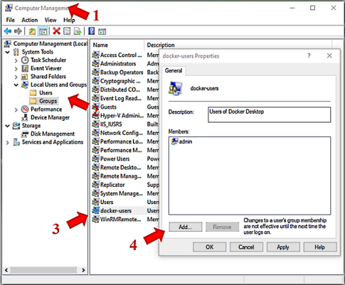

# D.T on Docker Setup  <!-- omit in toc -->

[Docker](https://www.docker.com/) is a container system that can be used to set up all of the infrastructure needed to run a web site. The below will setup containers locally needed to run a MySQL database and an Apache + PHP web server

All of this will be running on a Linux virtual machine in order to duplicate as close as possible the production hosting environment.

[playlist]: https://www.youtube.com/playlist?list=PLNZnizaetELN6_2k3_iRxBhJuyavhqawE

## Contents  <!-- omit in toc -->

- [Three Choices](#three-choices)
- [Setup Docker](#setup-docker)
  - [Install Docker](#install-docker)
  - [Configure SSL](#configure-ssl)
  - [Configure Docker](#configure-docker)
    - [***Prepackaged Image***](#prepackaged-image)
    - [***Video Walk-through***](#video-walk-through)
    - [***Example Template***](#example-template)
  - [Start Wordpress](#start-wordpress)
  - [Install Theme](#install-theme)
  - [Install Plugins](#install-plugins)
- [Enable Debugging](#enable-debugging)
- [Docker Multi-site Setup](#docker-multi-site-setup)

## Three Choices

There are currently three sets of instructions for setting up a Disciple Tools server locally using Docker.  Choose the one that suites your needs best.

1. Prepackaged Image  

   <https://github.com/zdmc23/dt-docker> is the easiest of the three to install (similar effort to setting up a [LocalWP](localWP-setup.md) environment), but it is difficult to update preinstalled plugins.

1. Video Walk-through

    This [YouTube playlist][playlist] shows how to set up for D.T. Mobile App development on a local machine, which includes setting up the Docker server environment

    The videos do not follow these instructions exactly, but it is better to use them to help understand these instructions, instead of following them by themselves.

1. Example Template

   <https://github.com/cairocoder01/dt-docker> which these instructions were originally based on, and provides a downloadable set configuration files, which can be updated.

## Setup Docker

### Install Docker

- Install the correct Docker download for your platform <https://docs.docker.com/get-docker/>

> **For Windows:**
>
> - When you start the Docker Desktop, **if necessary** it will provide you with additional instructions to update WSL 2 (Windows Subsystem for Linux)
> - If the user account you commonly use does not have admin privileges, it will be added to the docker-users group so you can run docker directly **without** requiring “runas”.
> 

### Configure SSL

Set up the self-signed SSL certificate. (The instructions are explained [here](https://medium.com/@nh3500/how-to-create-self-assigned-ssl-for-local-docker-based-lamp-dev-environment-on-macos-sierra-ab606a27ba8a) in detail)

> **Warning:** If you will be working on the **Mobile app** code, it [does not currently support Https](mobile-app-setup.md##https-workaround) when connecting to a local server, so this step is not required.

> **For Windows:**
>
> - The instructions above for MacOs work if you have OpenSSL installed
> - OpenSSL is available via
>   [Git Bash](https://git-scm.com/download/win),
>   [Ubuntu for Windows](https://www.microsoft.com/en-us/store/p/ubuntu/9nblggh4msv6?SilentAuth=1),
>   [Cygwin](https://www.cygwin.com/),
>   or [Chocolatey](https://www.cygwin.com/)

> **Note:** Already updated *dev.conf* and *dockerfile* configuration files are available from <https://github.com/cairocoder01/dt-docker>

1. From command line in the project root directory (your copy of the Github repository) run:

   ```shell
   > openssl req -x509 -nodes -days 365 -newkey rsa:2048 -keyout server.key -out server.crt
   ```

1. Specify the Common Name as 'local.disciple.tools'. You may answer the other questions however you wish.

1. Site will be available on <https://local.disciple.tools> (if you add the needed hosts file mapping) or <https://localhost:44300>

### Configure Docker

Configure Docker according to which one of the [3 approaches](#three-choices) you choose:

#### ***Prepackaged Image***  

   1. Download the `docker-compose.yml` file from <https://github.com/zdmc23/dt-docker> into your working directory (or clone it from GitHub)
   1. Create a `.env` file and copy/paste the following, and then update the values:

      ```shell
      DOMAIN=mydomain
      EMAIL=noreply@mydomain
      MYSQL_USER=wordpress
      MYSQL_PASSWORD=wordpress
      MYSQL_ROOT_PASSWORD=somewordpress
      ```

      (`DOMAIN` value can be an IP address - e.g., `127.0.0.1` or `192.168.1.2`)

#### ***Video Walk-through***

- As mentioned [above](#three-choices), the [YouTube playlist][playlist] works best to help understand these instructions, rather than following it alone.

#### ***Example Template***

- These instructions were originally based on <https://github.com/cairocoder01/dt-docker>
- Download the files, or clone the repository from GitHub, to use as a template.

### Start Wordpress

> **Warning:** The configuration files were up to date the last time they were edited, but *always* make sure to double check what the most up to date versions of the software components are, or make certain to install mutually compatible versions.
>
> For example, the *dockerfile* should have up to date version numbers for Wordpress and PHP.
>
> - The first line will look like:
> `FROM wordpress:5.4-php7.4-apache`
> - Check <https://github.com/DiscipleTools/disciple-tools-theme/releases/latest> for which version of Wordpress disciple-tools-theme has been tested with.>
> <br><br>

1. Run `docker-compose up -d` from the project root directory (or `npm run docker-start`).

   1. The first time this is run, it will need to download all of the machine images, so it may take a little while.
   2. There will be some warning messages that can be ignored, unless Docker cannot bring the Wordpress and Mysql containers up.

2. You should be able to access the site via <https://local.disciple.tools> (if you add the needed hosts file mapping), <https://localhost:44300> or <http://localhost:8000>

   > **For Windows:** You will need to add a “security exception” in your browser from its warning dialog (depending on browser).

   >**Warning:** When you configure WordPress from “<https://localhost:44300>” or “<http://localhost:8000>” you will have to continue to use that address or reconfigure it from the …/wp-admin/options-general.php settings page to switch.

3. Step through the WordPress installation process.

   - Language:
   - Site Title:
   - Username:
   - Password:
   - Your Email:
   - Press “Install WordPress”

>**Note:** If you cannot access DT’s home page: <https://localhost:44300/contacts> or other pages try this:
>
> - Login to *wp-admin* and go to  *Settings > Permalinks*. *You don’t need to change anything*, just click *Save* at the bottom.  
> (Source: <https://disciple-tools.readthedocs.io> section: [Errors on New Installation](https://disciple-tools.readthedocs.io/en/latest/Disciple_Tools_Theme/development/self_hosting.html#errors-on-new-install))

### Install Theme

> **NOTE:** If you used the [**Prepackaged Image**](#prepackaged-image) this has already been done for you.  
> **However,** if you need to update the theme you must do it manually from within the container!

1. Go to <https://github.com/DiscipleTools/disciple-tools-theme>

2. Download latest release: <https://github.com/DiscipleTools/disciple-tools-theme/releases/latest/download/disciple-tools-theme.zip>

3. Follow installation instructions: <https://github.com/DiscipleTools/disciple-tools-theme#how-to-install>

### Install Plugins

> **NOTE:** If you used the [**Prepackaged Image**](#prepackaged-image) some plugins have already been installed for you.  
> **However,** if you need to update a pre-installed plugin you must do it manually from within the container!

Some production plugins are available for installation from the **Extensions** tab.  For developement, or unlisted plugins:

1. Download the latest plugin zip files from below, and install plugins using these instructions: <https://wordpress.org/support/article/managing-plugins/#manual-upload-via-wordpress-admin>

   1. <https://github.com/DiscipleTools/disciple-tools-demo-content>
   2. <https://github.com/WP-API/Basic-Auth>

2. Download JWT Authentication for WP REST API from: <https://wordpress.org/plugins/jwt-authentication-for-wp-rest-api/>

   1. Follow directions on plugin page to add auth header config to .htaccess
   2. Follow directions on plugin page to add 2 values to wp-config.php

## Enable Debugging

- Edit wp-config.php to add the following values:

   ```php
   define( 'WP_DEBUG', true ); // Enable WP_DEBUG mode
   define( 'WP_DEBUG_LOG', true ); // Enable Debug logging to the /wp-content/debug.log file
   ```

## Docker Multi-site Setup

See <https://www.wpbeginner.com/glossary/multisite/>

1. Add the following to `wp-config.php`

   ```php
   /* Multisite */
   define('WP_ALLOW_MULTISITE', true);
   ```

1. Go to Tools -> Network Setup and follow on-screen directions, adding the necessary code to .htaccess and wp-config.php

1. After changes, login again and return to wp-admin.

1. A new My Sites item appears in the top menu. Go to My Sites -> Network Admin -> Dashboard
   - Copy `disciple-tools-multisite.php` into `wp-content/plugins/disciple-tools-multisite`

1. Add all of the sites as you desire.

   - For each site you add, add the needed entry to your local hosts file.  
     For example:

      ```ini
      127.0.0.1   site1.local.disciple.tools
      ```
