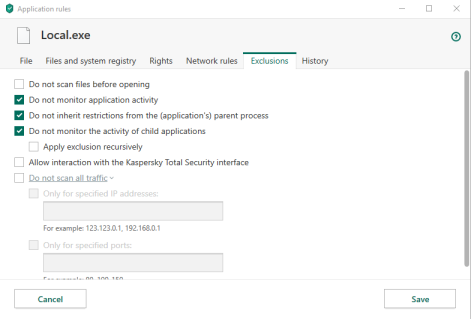

# LocalWP

[LocalWP](https://localwp.com/#) provides a simple way to configure a WordPress development environment.  

1. Install LocalWP on your machine:

   a. Download the appropriate installer for your platform from the list on: <https://localwp.com/community/>
      - *If a dialog asking for your platform type appears*, you must have pressed the DOWNLOAD button in the upper right of the web page *instead* - You do not have to fill in all the information, but you must give your email address.
      - The installer should download automatically, if not then follow the instructions

   b. Installing LocalWP on **MacOS** and **Linux** is straight forward. For Windows, especially with a 3rd-party antivirus, it requires more effort.

    > ***Note*:** Some VPNs set firewalls on your network configuration, which will likely conflict with LocalWP.

    > ## Installing on Windows
    >
    > - Select install for **all users** (requires Administrator privileges).
    > - **Run Local but do not create a website yet**, LocalWP needs to be able to write to your `c:\Windows\System32\Drivers\etc\hosts` file and set up SSL.  Your antivirus will not like this so you **must** first “whitelist” Local.
    >
    > - As an example: if you use Kapersky 2020, these are the steps: [*(source)*](https://localwp.com/community/t/how-to-run-local-5-0-7-windows-10-antivirus-software-kaspersky/15290)
    >   1. In the main windows go to More Tools -> Manage applications -> Application Controls -> Manage applications
    >   2. In the search box type “local”
    >   3. Double click on Local.exe – **Be careful it is the right application!**
    >   4. Under Exclusions check:
    >
    >      
    >
    >      - [X] Do not monitor application activity
    >      - [X] Do not inherit restriction from the (application's) parent process
    >      - [X] Do not monitor the activity of child applications
    >
    >   5. Press "Save"
    >  

2. LocalWP will ask if you want to create a new site, or press the large **&#x271A;** in the lower left corner.

   a. Provide a site name and choose ADVANCED OPTIONS to change defaults
      1. Change the site domain and browse for where you want your site’s code to be stored. (You may need to create the folder)  
         **e.g.** Name: D.T    Local site path: *D:\sandbox\DT   (e.g. as a Windows path)*
      2. Select “CONTINUE”

   b. Choose “Preferred” environment
      1. Select “CONTINUE”

      > Select the custom option with different values if you run into an issue.

   c. Provide WordPress Username, Password and Email address
      - **If** you wish the site to be **Multisite**, select this under ADVANCED OPTIONS
      - Select “ADD SITE”
  
   d. Wait for WordPress, etc. to be downloaded and the site to be created

      >- ***Warning***: This can fail if there is no write access to your hosts file, or your antivirus does not give LocalWP sufficient permissions.

      >- ***In Windows:*** if you are not running as an administrator you will need to give it permission to update the hosts file.
      >- This and other changes will need admin approval.  An alternative is to change the LocalWP shortcut’s Properties -> Advanced… so it always runs as Administrator, but this *can* cause security issues.

   e. You can access your site via **both** http:// and https://

   - LocalWP will create an SSL certificate if you select the **TRUST** button (which will bypass your browser’s security warning)
   - e.g. If the site’s name is D.T, then both addresses will work `http://dt.local` and `https://dt.local`

3. Install Theme.
   See <https://github.com/DiscipleTools/disciple-tools-theme>

    1. Follow installation instructions:  
        <https://github.com/DiscipleTools/disciple-tools-theme#how-to-install>
    2. Download latest release:  
        <https://github.com/DiscipleTools/disciple-tools-theme/releases/latest/download/disciple-tools-theme.zip>

4. Some plugins are available for installation from the **Extensions** tab

   If you need the latest plugin, download the zip files from GitHub, and install plugins using these instructions:  
   <https://wordpress.org/support/article/managing-plugins/#manual-upload-via-wordpress-admin>

   - e.g. <https://github.com/DiscipleTools/disciple-tools-demo-content>
