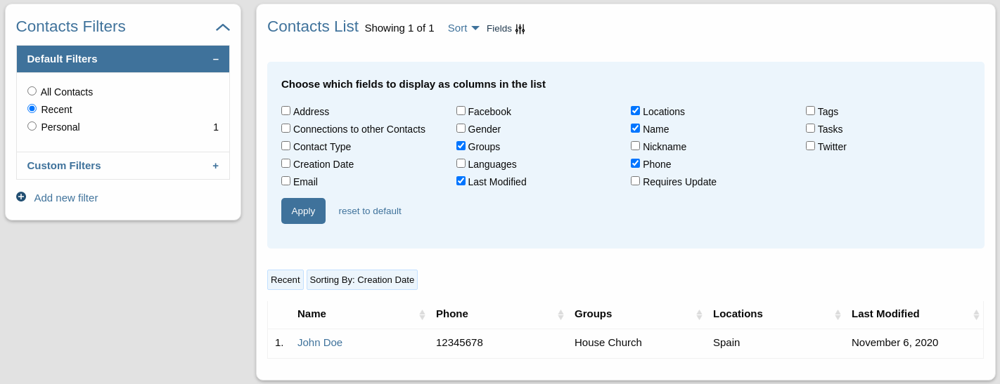

# Changes and New Features for Disciple.Tools Theme Version 1 

We've made a few major changes to the theme and are happy to announce:
- Personal Contacts, Access Contacts and Connection Contacts. 
- Upgraded Contact and Group Record and List Pages.
- More flexibility in Roles, customizing fields.

## Contact Types
As a D.T system grows, users and contact are added. It soon becomes overwhelming and a possible security issue for an admin to have access to all contacts in the system.
For clarity we strive to show each user only what they need to focus on.

First of all we now have the **Personal** contacts type.  
With **personal** contacts, users can create contacts that are only visible to them. The user can share the contact for collaboration. 
This lets multipliers track their oikos ( friends, family and acquaintances ) without worrying about who can see the details.

For collaboration we've distinguished the **Access** contact type.  
These are contacts coming from an Access strategy like a Web page, Facebook page, Camp, etc. Certain roles like the Digital Responder or the Dispatcher have permission to and responsibility of fielding the leads driving the next steps.   

As we work towards a DMM more contacts will be creating to represent the progress. So we create the **Connection** contact type.  
If a multiplier is responsible for a contact and that contact baptizes their friend, we want to record the progress. To represent the baptism the friend is created as a **connection** contact. The multiplier has permission to view and update this contact but does not have direct responsibility for the friend.
This lets the multiplier record progress and activity without overwhelming their working list. 

### Where does this show up?
- When creating a new contact: you will be asked to choose a contact type before continuing.
- On the contact record different field will be shown depending on the contact type.
- On the list page you have have filters for your personal, connection and access contacts.

## Bonus UI changes.

### List
- Chose what fields will show up in yo.r contacts and groups list.
- Filter for recently viewed records
- Drag list columns to rearrange them.
- [More capable list querying API](../list-query.md).

### Contact and Group record pages.
- All the tiles and now modular. Add fields to any tile you want, even the details tile.
- Different field show for each contact type.
- Customize New Contact and New Group pages.
- Delete a record you have personally created.
- [Better way to add tiles](../field-and-tiles.md)

### New modules Feature
Modules extend the functionality of a post type like Contacts or Groups.
A modules can be used to add:
- Fields
- Workflows
- List filters
- Roles
- Other functionality

A module resembles what can be done through a plugin. The big difference is the instance admin can enable/disable the modules they want and the theme/plugins can package multiple modules.

With v1.0 the D.T theme has 2 main modules available by default: the DMM module and the Access modules.  
The DMM adds fields, filters and workflows that go with: coaching, faith milestones, baptism date, baptisms etc. These are fields needed for any DMM.    
The Access module focuses more on contact followup and come with fields like the seeker path, the assigned_to and subassigned. It also adds our Follow-up filter tab on the lists page.

[See developer modules documentation](../modules.md)

### Modular Roles and Permissions
- Add new roles with permissions that fit your needs. 
- Create a role and give that role access to certain permissions, tags, sources or anything you want.

[See roles documentation for developers](../roles-permissions.md)

# Code Development
See list of code changes: [here](./v1.0.0-dev-changes.md) 