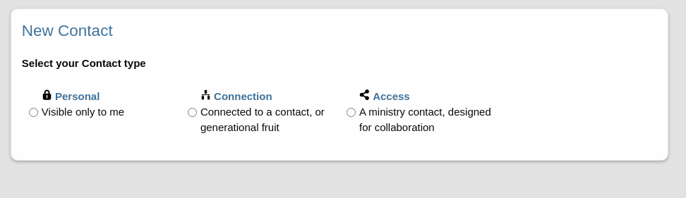
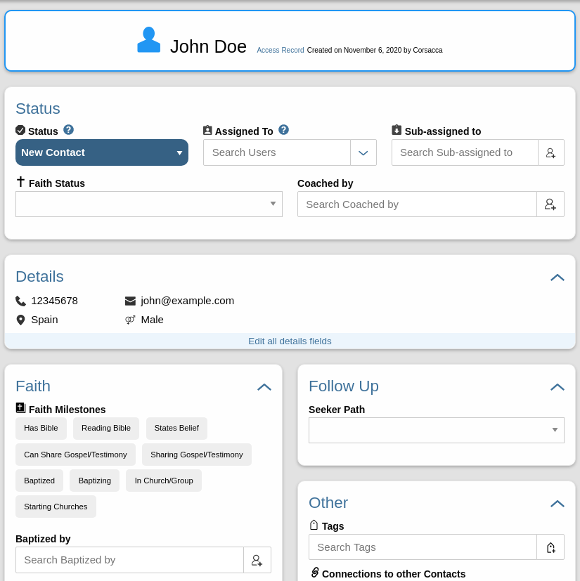

# Disciple.Tools Theme Version 1.0: Changes and New Features

## We've made a few major changes to the theme and are happy to announce:
- Contact Types: Personal Contacts, Access Contacts and Connection Contacts 
- UI Upgrades: Upgraded Lists and Records Pages
- Modular Roles and Permissions
- Enhanced Customization: New "modules" feature and the DMM and Access modules

&nbsp;&nbsp;

## Contact Types
Previously, certain roles such as the Admin were able to see all system contact records. This presented security, trust and management/workflow issues that needed to be navigated, especially as Disciple.Tools instances grew and added hundreds of users and thousands of contacts.  For clarity we attempt to show each user only what they need to focus on.  By implementing **contact types**, users have far more control over access to private information.

### **Personal** contacts  
To start, with **personal** contacts, users can create contacts that are only visible to them. The user is able to share the contact for collaboration, but is private by default. This lets multipliers track their oikos ( friends, family and acquaintances ) without worrying about who can see the details.

### **Access** contacts  
This contact type should be used for contacts that come from an **access** strategy like a web page, Facebook page, sports camp, English club, etc.  By default, collaborative follow-up of these contacts is expected. Certain roles like the Digital Responder or the Dispatcher have permission and responsibility for fielding these leads and driving towards next steps that would lead to handing the contact off to a Multiplier.  This contact type most resembles former standard contacts.  

### **Connection** contacts  
The **Connection** contact type can be used to accommodate for movement growth.  As users progress toward a movement more contacts will be created in connection to that progress. 

This can contact type can be thought of as a placeholder or soft contact.  Often the details for these contacts will be extremely limited and the user's relationship to the contact will be more distant.  

*Example: If a Multiplier is responsible for Contact A and Contact A baptizes their friend, Contact B, then the Multiplier will want to record this progress. When a user needs to add a contact simply to represent something like a group member or baptism, a **connection** contact can be created.* 

The Multiplier is able to view and update this contact, but does not have an implied responsibility that compares to the responsibility of **access** contacts.  This lets the Multiplier record progress and activity without overwhelming their working list, reminders and notifications. 

While Disciple.Tools has developed as a solid tool for collaborative **access** initiatives, the vision continues that it will be an extraordinary movement tool that will aid users in every phase of Disciple Making Movements (DMM).  **Connection** contacts is a push in this direction. 

### Where do contact types show up?
- On the list page, you now have additional filters available to help differentiate focus on your personal, access and connection contacts.
- When creating a new contact, you will be asked to choose a contact type before continuing.
- On the contact record, different fields will be shown and different workflows enacted depending on the contact type.

&nbsp;&nbsp;

## UI upgrades

### List Pages
- Choose which fields will show up on your contacts and groups lists.
  - The Admin can set up system defaults with greater flexibilty
  - Users can tweak or change defaults to meet their unique preference or need
- Drag field columns to rearrange them on list pages.
- Filter for recently viewed records
- [More capable list querying API](../list-query.md) (for developers).

### Record Pages
- Customize **Create New Contact** and **Create New Group** entry pages.
- All the tiles are now modular. Add fields to any tile you want, even the Details tile.
- Condensed display of record details.
- Specific fields show for each contact type.
- Delete a record you have personally created.
- [Better way to add tiles](../field-and-tiles.md)(for developers).

&nbsp;&nbsp;

## Modular Roles and Permissions
- Add new roles with permissions that fit specific needs. 
- Create a role and give that role access to certain permissions, tags, sources or anything you want.
- This is a stepping stone to adding greater **team** functionality within Disciple.Tools

[See roles documentation](../roles-permissions.md) (for developers)

&nbsp;&nbsp;

## Enhanced Customization 

### New "modules" feature
Modules extend the functionality of types of records like Contacts or Groups. A module resembles what can be done through a plugin. The big difference is that modules can be added to a Disciple.Tools system while allowing each instance Admin to enable/disable the modules they want or need. The core theme and plugins can now package multiple modules.  A developer is still needed to create a module, but once created, control of its use can be distributed to the Admin of each site.

A module can be used to add/modify:
- Fields on records
- List filters
- Workflows
- Roles & Permissions
- Other functionality

### New DMM and Access modules  
With the v1.0 release, the Disciple.Tools theme has added 2 main modules by default.

The **DMM module** adds fields, filters and workflows that pertain to: coaching, faith milestones, baptism date, baptisms etc. These are fields needed for anyone pursuing a DMM. 

The **Access module** focuses more on collaborative contact followup and come with fields like the seeker path, assigned_to and subassigned fields and update needed functionality. It also adds a **follow-up** tab to the filters on the contact list page.

[See modules documentation](../modules.md) (for developers)

&nbsp;&nbsp;

&nbsp;&nbsp;

# Code Development
See list of code changes: [here](./v1.0.0-dev-changes.md) 
