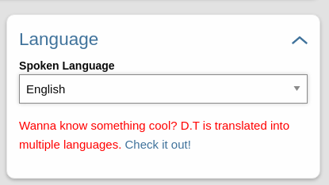

# Adding Fields and Tiles.

## Adding a field to track
You need tell Disciple.tools that you want to track something new. Fields are defined in the theme’s custom post type file. And we give you a way to add to that list using the dt_custom_fields_settings filter.

Here is an example on how to add a spoken language field on the contact:
```
add_filter( "dt_custom_fields_settings", "dt_contact_fields", 1, 2 );
function dt_contact_fields( array $fields, string $post_type = ""){
    //check if we are dealing with a contact
    if ($post_type === "contacts"){
        //check if the language field is already set
        if ( !isset( $fields["language"] )){
            //define the language field
            $fields["language"] = [
                "name" => __( "Spoken Language", "disciple_tools_language" ),
                "type" => "key_select",
                "default" => [
                    "english" => __( "English", "disciple_tools_language" ),
                    "french" => __( "French", "disciple_tools_language" )
                ],
                "tile" => "contact_language"
            ];
        }
    }
    //don't forget to return the update fields array
    return $fields;
}
```
See [Field Options](fields.md) for documentation on field types.

## Adding a Tile
```
add_filter( 'dt_details_additional_tiles', 'dt_details_additional_tiles', 10, 2 );
public function dt_details_additional_tiles( $tiles, $post_type = "" ){
    if ( $post_type === "contacts" ){
        $tiles["contact_language"] = [ "label" => __( "Language", 'disciple_tools' ) ];
    }
    return $tiles;
}
```

Since the language field is already declared in the fields list with the "contact_language" tile, D.T will take care of displaying the field.

## Add custom content

If you desire to display a field or element your own way you can also do so:
Change the filter priority to determine the order of this code

```
add_action( "dt_details_additional_section", "dt_add_section", 30, 2 );
function dt_add_section( $section, $post_type ) {
    if ( $section === "contact_language" && $post_type === "contacts" ) {
        ?>
        <!-- need you own css? -->
        <style type="text/css">
            .required-style-example {
                color: red
            }
        </style>

        <p class="required-style-example"> Wanna know something cool? D.T is translated into multiple languages. <a href="https://disciple.tools/translation/">Check it out!</a></p>

        <script type="application/javascript">
            //enter jquery here if you need it
            jQuery(($) => {
            })
        </script>
        <?php
    }
}
```

## End result

