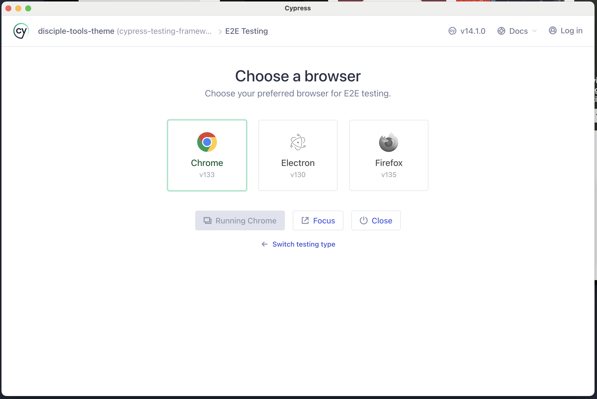
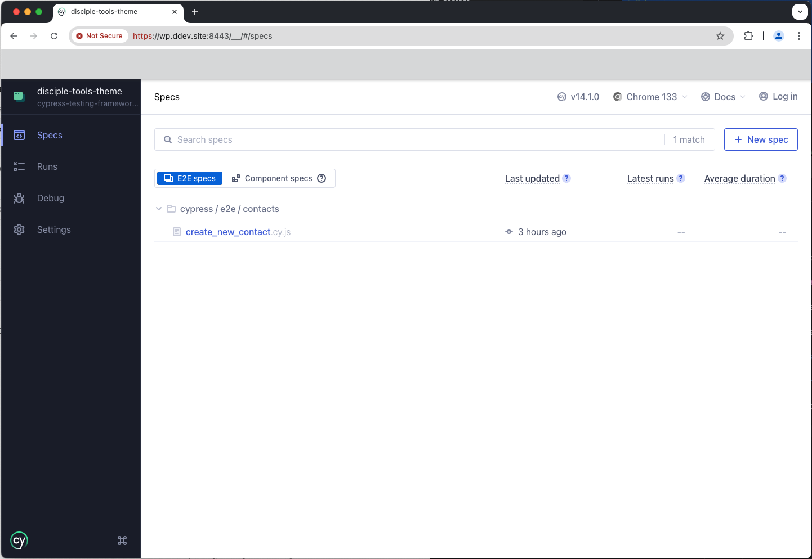

# Cypress Tests

Support for the [Cypress Testing Framework](https://www.cypress.io) has now been integrated into D.T.

With Cypress, you can easily create declarative tests, debug them visually and automatically run them in your continuous integration builds.

## Getting started

From the terminal, navigate to the `disciple-tools-theme` directory and execute `npm run cy:open`; which should display the Cypress Launchpad.

From there, select the `E2E Testing` option; which should then display the following browser selection view.



See [Cyress Open The App](https://docs.cypress.io/app/get-started/open-the-app) guide for more details.

On browser selection, you should then be taken to the End To End (E2E) view; as shown below.



## E2E Folder Structure

The view from the previous section, displays all E2E tests created under the `./cypress/e2e` directory; which is organised as follows:

- __./cypress/e2e/contacts/__
  - Siloed unit tests, covering the testing of `contacts` post type related functionality; such as creating, updating and deleting records, searching, etc.
  - Please follow the pattern shown, when introducing tests for new features.


- __./cypress/support/commands.js__
  - A holding area for custom functions; typically duplicate code; which can be encapsulated into a global function.
  - The following custom functions have been created:
    - _dtLogin()_
      - D.T frontend login.


## Running Environment

Currently, all tests are run locally; so, you'll need to update the base url and admin credentials within the `./cypress.config.js` file.

```js
import { defineConfig } from "cypress";

export default defineConfig({
  e2e: {
    setupNodeEvents(on, config) {
      // implement node event listeners here
    },
    baseUrl: '<LOCAL_DEV_INSTANCE_HTTP_URL>'
  },
  dt: {
    credentials: {
      admin: {
        username: '<LOCAL_DEV_ADMIN_USR>',
        password: '<LOCAL_DEV_ADMIN_PWD>'
      }
    }
  }
});
```

Lastly, the following Cypress user guides also provide useful information, for gaining a better understanding of the framework.

- [Cypress - Your First Test](https://docs.cypress.io/app/end-to-end-testing/writing-your-first-end-to-end-test)
- [Cypress - Testing Your App](https://docs.cypress.io/app/end-to-end-testing/testing-your-app)